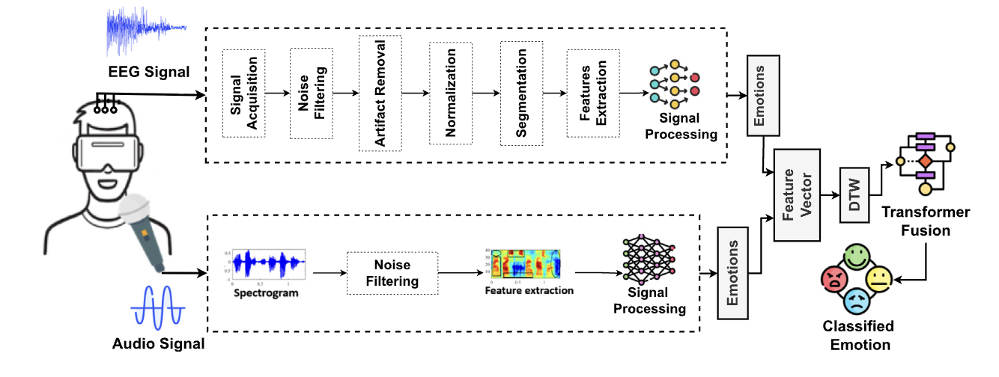
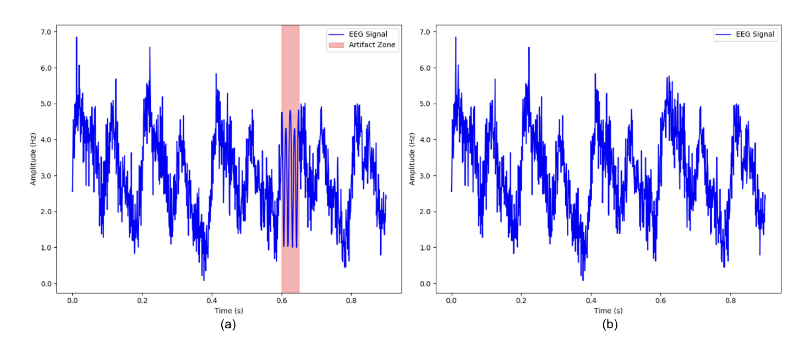
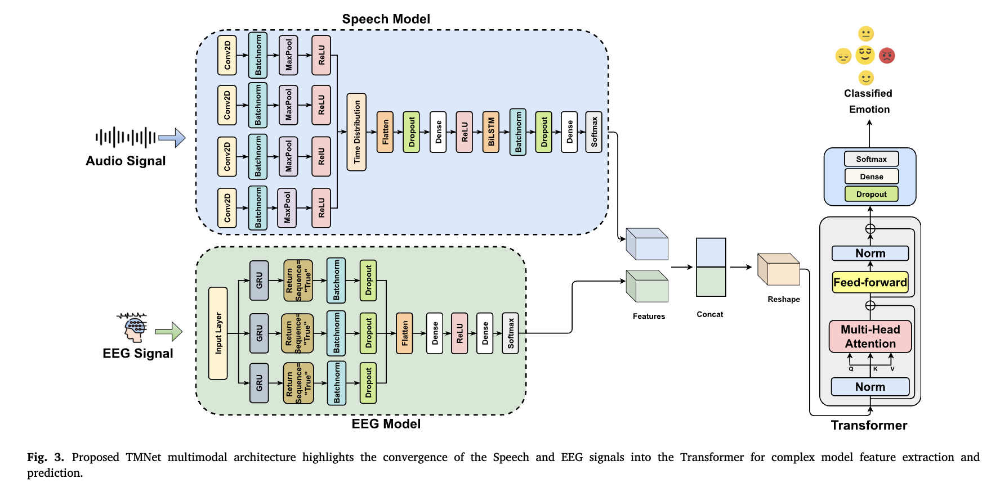

# TMNet: Transformer-Fused Multimodal Emotion Recognition

[](https://www.sciencedirect.com/science/article/pii/S2405959525000517)

TMNet is a deep learning framework that fuses **speech** and **EEG** brain signals to classify human emotional states into three categories — **Positive**, **Neutral**, and **Negative**. It achieves **98.89% accuracy** on the benchmark dataset, outperforming state-of-the-art unimodal and multimodal baselines.

---

## Overview

<p align="center">
  
</p>
<p align="center"><em>Fig. 1. Proposed workflow of the multimodal emotion recognition framework.</em></p>

The pipeline processes two parallel streams:

- **Speech stream** — audio waveforms undergo pre-emphasis, Wiener denoising, energy-based Voice Activity Detection (VAD), and MFCC extraction (40 coefficients + Δ + ΔΔ).
- **EEG stream** — brain signals are band-pass filtered (0.5–45 Hz), cleaned via FastICA, z-score normalised, and converted to sliding-window statistics (mean, std).

Dynamic Time Warping (DTW) synchronises the two modalities before resampling to a common temporal grid, after which a fusion classifier learns inter-modal dependencies and produces the final emotion prediction.

---

## Architecture

### EEG Signal Preprocessing

<p align="center">
  
</p>
<p align="center"><em>Fig. 2. Artifact removal from EEG signal of positive emotion: (a) original signal with artifacts, (b) artifact-free signal after ICA processing.</em></p>

### TMNet Model Architecture

<p align="center">
  
</p>
<p align="center"><em>Fig. 3. Proposed TMNet multimodal architecture highlights the convergence of the Speech and EEG signals into the Transformer for complex model feature extraction and prediction.</em></p>

The model stack consists of three components:

| Component | Architecture | Output |
|-----------|-------------|--------|
| **Speech Encoder** | 4× Conv2D + BatchNorm + MaxPool → TimeDistributed Flatten → Dense(512) → Bidirectional LSTM(128) | 5-class logits |
| **EEG Encoder** | 3× Bidirectional GRU (64→128→64) + BatchNorm + Dropout → Dense(128) | 3-class logits |
| **Fusion Block** | Concatenate logits → Dense(256, ReLU) → Dropout(0.3) → Softmax classifier | 3-class prediction |

---

## Results

### Comparison with Existing Approaches (Table 4)

| Model | Method | Accuracy (%) | Precision (%) | Recall (%) | F1 Score (%) |
|-------|--------|:---:|:---:|:---:|:---:|
| Multimodal Transformer [5] | Transformer, SVM | 91.79 | 92.00 | 91.50 | 91.70 |
| Late Fusion [26] | CNN, GRU, Encoder | 95.39 | 95.50 | 95.30 | 95.38 |
| Feature Level Fusion [27] | SVM | 87.44 | 87.60 | 87.30 | 87.45 |
| Decision Level Fusion [4] | kNN, SVM | 96.24 | 96.12 | 95.91 | 95.87 |
| Hierarchical LSTM + Self-Attention [28] | LSTM, Attention | 94.86 | 93.96 | 94.89 | 94.88 |
| Multi CNN Fusion [29] | DeepVANet, CNN | 95.61 | 95.11 | 95.08 | 95.01 |
| **TMNet (ours)** | **CNN-BiLSTM, BiGRU, Transformer** | **98.89** | **99.00** | **98.80** | **98.88** |

---

## Repository Structure

```
Multimodal-Emotion-Recognition/
├── src/
│   ├── preprocessing/
│   │   ├── speech.py          # Pre-emphasis, VAD, Wiener denoise, MFCC extraction
│   │   └── eeg.py             # Band-pass filter, FastICA, z-score, sliding-window stats
│   ├── models/
│   │   ├── speech_model.py    # CNN + Bidirectional LSTM encoder
│   │   ├── eeg_model.py       # Stacked Bidirectional GRU encoder
│   │   └── fusion_model.py    # TMNet multimodal fusion model
│   ├── utils/
│   │   ├── augmentation.py    # SpecAugment-style time/frequency masking + Gaussian noise
│   │   └── alignment.py       # DTW alignment and temporal resampling
│   └── data/
│       └── loader.py          # Dataset loading utilities
├── assets/                    # Paper figures (see assets/README.md)
├── Model/                     # Saved trained model weights
│   ├── my_model.h5            # Speech CNN-BiLSTM
│   ├── my_model_gru.h5        # EEG BiGRU
│   └── multimodal_model.keras # TMNet fusion model
├── Output/                    # Sample prediction visualisations
├── TMNet.ipynb                # End-to-end experiment notebook
└── requirements.txt
```

---

## Datasets

The project uses two publicly available datasets:

- **Speech:** Organised under `Datasets/Speech/<Emotion>/` with sub-directories `Angry`, `Calm`, `Neutral`, `Happy`, `Sad`. Accepted formats: `.wav`, `.flac`, `.mp3`, `.ogg`.
- **EEG:** A single CSV file at `Datasets/EEG/emotions.csv` containing 750 FFT-band features per sample and a `label` column (`POSITIVE`, `NEUTRAL`, `NEGATIVE`).

The 5 speech emotion classes are mapped to 3 general classes for fusion:

| Speech Emotion | General Class |
|----------------|--------------|
| Angry | Negative |
| Sad | Negative |
| Happy | Positive |
| Calm | Positive |
| Neutral | Neutral |

---

## Installation

### 1. Clone the repository

```bash
git clone https://github.com/mahinuralam/multimodal-emotion-recognition.git
cd multimodal-emotion-recognition
```

### 2. Create a virtual environment (recommended)

```bash
python -m venv .venv
source .venv/bin/activate        # Linux / macOS
.venv\Scripts\activate           # Windows
```

### 3. Install dependencies

```bash
pip install -r requirements.txt
```

### 4. Prepare datasets

Place your speech files and EEG CSV following the structure in the [Datasets](#datasets) section above, then update the path variables at the top of `TMNet.ipynb` to point to your local copies.

---

## Usage

### Running the full experiment

Open and execute the notebook from the repository root:

```bash
jupyter notebook TMNet.ipynb
```

Run the cells in order:

| Step | Description |
|------|-------------|
| 1. Speech Preprocessing | Load audio, extract MFCC features, apply SpecAugment augmentation |
| 2. EEG Preprocessing | Load CSV, band-pass filter, FastICA, build feature sequences |
| 3. Speech Model Training | Train CNN-BiLSTM, save to `Model/my_model.h5` |
| 4. EEG Model Training | Train BiGRU, save to `Model/my_model_gru.h5` |
| 5. Multimodal Alignment | DTW-align speech and EEG sequences, resample to common length |
| 6. Fusion Training | Train TMNet, save to `Model/multimodal_model.keras` |
| 7. Evaluation | Generate confusion matrices and classification reports |


---

## Citation

If you use this code or the TMNet architecture in your research, please cite:

```bibtex
@article{alam2025tmnet,
  title     = {TMNet: Transformer-fused multimodal framework for emotion recognition via EEG and speech},
  author    = {Alam, Md Mahinur and Dini, Mohamed A and Kim, Dong-Seong and Jun, Taesoo},
  journal   = {ICT Express},
  year      = {2025},
  publisher = {Elsevier},
  doi       = {10.1016/j.icte.2025.02.007},
  url       = {https://www.sciencedirect.com/science/article/pii/S2405959525000517}
}
```

---
